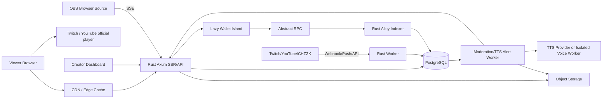

# RILL3(릴쓰리) — Rust-first Web3 방송 허브 마스터 플랜

작성 기준일: 2026-09-02  
프로젝트 성격: 외부 라이브 방송 집계 + 공식 임베드 + 비수탁형 온체인 후원 + OBS 알림 플랫폼

> **한 문장 정의:** 방송인은 Twitch·YouTube·CHZZK 등 기존 플랫폼에서 계속 방송하고, RILL3는 방송 발견·통합 프로필·직접 지갑 후원·TTS/영상 알림·공개 후원 장부를 제공한다.

## 1. 이름과 브랜드

### 최종 개발명: RILL3

- 읽는 법: **릴쓰리**
- 의미: `rill`은 작은 물줄기(stream), `3`은 Web3를 뜻한다.
- 한국어 슬로건: **“방송은 어디서 하든, 후원은 직접·투명하게.”**
- 영어 슬로건: **“Stream anywhere. Tip directly.”**
- 출시 전에는 한국·미국·EU 상표와 도메인을 별도로 조사한다. 현재는 저장소와 MVP의 코드명으로 사용한다.

대체 후보:

- TipMesh — 여러 플랫폼과 후원을 연결하는 망
- OnRelay — 온에어와 온체인을 잇는 중계층
- CastRail — 방송과 후원이 같은 레일을 타고 전달된다는 뜻

## 2. 제품 전략

### 만들려는 것은 “또 하나의 Twitch”가 아니다

처음부터 영상 업로드·인코딩·송출·CDN까지 직접 운영하면 비용과 운영 난도가 제품의 핵심 가치를 삼켜버린다. 첫 제품은 다음 세 요소에 집중한다.

1. **외부 방송 허브**
   - 등록된 방송인의 Twitch, YouTube, CHZZK 채널 상태를 공식 API·웹훅으로 동기화한다.
   - 임베드를 공식 지원하는 플랫폼은 RILL3 안에서 재생한다.
   - 공식 임베드가 없거나 약관이 불명확하면 썸네일과 외부 링크만 제공한다.
   - 비공개 API, HLS 주소 추출, 무단 재송출, 화면 스크래핑은 하지 않는다.

2. **직접·투명한 Web3 후원**
   - 기본 체인은 Abstract로 시작하되 체인 어댑터를 둬서 향후 Base·Kaia 등으로 확장할 수 있게 한다.
   - 단순 후원은 지갑 주소/QR로 바로 보낸다.
   - 메시지·TTS·영상 알림이 필요한 “인터랙티브 후원”은 일회성 후원 의도(`tip_intent`)와 `TipRouterV1` 이벤트를 연결한다.
   - 컨트랙트는 후원금을 같은 트랜잭션 안에서 방송인 지갑으로 전달하고 잔액을 보관하지 않는다.
   - 공개 장부에는 금액·자산·송신 주소·수신 주소·수수료·트랜잭션만 표시한다. 메시지·음성 원문·영상 URL은 온체인에 쓰지 않는다.

3. **OBS용 후원 알림**
   - 방송인이 OBS에 RILL3 브라우저 소스 URL 하나를 추가한다.
   - 결제 확인 후 텍스트, TTS, 라이선스된 커스텀 음성, YouTube/Twitch 공식 임베드 영상 알림을 순서대로 재생한다.
   - 방송 플랫폼의 임베드 플레이어 위에 후원 UI를 덮지 않는다. 시청 페이지 후원 패널은 플레이어 옆 또는 아래에 둔다.

## 3. MVP 사용자 흐름

### 방송인

1. 지갑 서명으로 로그인한다.
2. 공개 프로필과 슬러그를 만든다.
3. Twitch/YouTube/CHZZK 계정을 OAuth 또는 공식 검증 절차로 연결한다.
4. 수령 지갑을 EIP-712 형식의 nonce·만료 포함 서명으로 검증한다.
5. 최소 후원액, 허용 자산, 메시지 길이, TTS 음성, 영상 길이, 차단어, 쿨다운을 설정한다.
6. OBS 브라우저 소스 URL을 복사한다.
7. 대시보드에서 후원 큐를 승인·건너뛰기·차단·환불 링크 생성할 수 있다.

### 시청자

1. 로그인 없이 방송 목록을 본다.
2. 방송인 페이지에서 외부 방송을 공식 임베드로 보거나 원 플랫폼으로 이동한다.
3. “후원”을 누를 때만 지갑 모듈을 지연 로딩한다.
4. 금액, 메시지, 음성, 영상 URL과 구간을 정한다.
5. 예상 수령액·네트워크·자산·수수료·환불 원칙을 확인한 뒤 서명한다.
6. 결제가 확정되면 방송인의 OBS 알림 큐에 들어간다.
7. 공개 장부에서 트랜잭션과 재생/거절 상태를 확인한다.

## 4. 페이지 구성

### `/`
- 현재 라이브 중인 등록 방송인 카드
- 플랫폼 배지, 제목, 카테고리, 시작 시각, 언어
- 홈에서는 iframe을 만들지 않고 썸네일만 표시
- 카드를 눌러 방송인 페이지로 이동

### `/c/{slug}`
- 공식 방송 임베드 또는 `외부에서 보기`
- 후원 패널
- 방송인 소개와 링크
- 최근 공개 후원 장부
- 플랫폼별 탭
- 모바일에서는 영상 아래에 접히는 후원 서랍

### `/c/{slug}/ledger`
- 체인, 자산, 총액, 방송인 실수령액, 공개 수수료, 트랜잭션 해시
- 송신 주소는 기본적으로 축약 표시
- 메시지는 후원자가 공개에 동의한 경우에만 노출
- 필터와 CSV 내보내기

### `/studio`
- 외부 채널 연결
- 지갑/자산 설정
- TTS·영상 규칙
- OBS URL과 테스트 알림
- 큐, 차단 목록, 감사 로그

### `/overlay/{rotating_key}`
- 투명 배경의 OBS 전용 페이지
- 페이지 로드 후 키를 단기 세션으로 교환
- SSE로 알림 수신
- 재생 완료/실패는 POST로 ACK
- 키는 즉시 회전 가능

## 5. 외부 플랫폼 연결 정책

### 공통 `StreamProvider` 계약

```rust
#[async_trait::async_trait]
pub trait StreamProvider: Send + Sync {
    fn kind(&self) -> ProviderKind;
    fn embed_capability(&self) -> EmbedCapability;

    async fn verify_channel(
        &self,
        input: VerifyChannelInput,
    ) -> Result<VerifiedChannel, ProviderError>;

    async fn fetch_live_state(
        &self,
        channel: &ExternalChannel,
    ) -> Result<LiveState, ProviderError>;

    async fn reconcile_many(
        &self,
        channels: &[ExternalChannel],
    ) -> Result<Vec<LiveState>, ProviderError>;

    fn external_url(&self, channel: &ExternalChannel) -> url::Url;
    fn embed_descriptor(&self, live: &LiveState) -> Option<EmbedDescriptor>;
}
```

`EmbedCapability`:

- `OfficialEmbed`
- `LinkOnly`
- `Manual`

모든 공급자 구현은 다음 원칙을 지킨다.

- 시청자 수와 API 호출 수를 분리한다. 시청자가 늘어도 외부 API 요청은 늘지 않는다.
- 웹훅/푸시가 있으면 우선 사용하고 저주기 정합성 검사만 한다.
- 429와 5xx에 지수 백오프, jitter, 회로 차단기를 적용한다.
- 원본 응답은 짧은 기간 암호화 또는 최소화해 보관하고 정규화된 상태만 서비스한다.
- 중복·역순 이벤트를 받아도 최종 상태가 일관되게 유지돼야 한다.

### Twitch

- 방송인 OAuth로 채널 소유권을 검증한다.
- `stream.online`, `stream.offline` EventSub 웹훅을 기본 신호로 사용한다.
- 누락 보정을 위해 등록 채널을 묶어 약 5분 간격으로 `Get Streams` 정합성 검사한다.
- 공식 Twitch iframe/JavaScript embed만 사용하며 `parent` 도메인을 정확히 설정한다.
- 홈 목록에는 플레이어가 아니라 API 썸네일만 쓴다.

### YouTube

- 방송인이 Google OAuth로 자신의 채널을 연결하게 한다.
- 인증된 채널은 자신의 방송 데이터 API와 WebSub 변경 알림을 조합한다.
- 공개 검색 API를 수십 초마다 호출하는 구조는 금지한다.
- OAuth 연결이 없는 채널은 현재 라이브 URL 수동 등록과 저주기 검증만 지원한다.
- `origin`을 지정한 공식 IFrame Player API만 사용한다.
- 플레이어 앞을 후원 UI나 클릭 유도 레이어로 덮지 않는다.

### CHZZK

- 공식 CHZZK Developers API만 사용한다.
- 등록된 방송인 중심으로 라이브 목록/상태를 30~60초 간격에서 적응형 폴링한다.
- API 장애·한도 접근 시 간격을 늘리고 마지막 정상 상태를 `stale`로 표시한다.
- 공식적으로 허용된 임베드 방식이 명확하지 않은 동안에는 `LinkOnly`가 기본이다.
- CHZZK 후원·채팅 이벤트 세션은 RILL3 결제와 섞지 않고 선택적 연동 기능으로 둔다.

### 기타 플랫폼

- `LinkOnlyProvider`로 URL, 아이콘, 썸네일, 라이브 수동 상태만 제공한다.
- 공식 API/oEmbed/iframe 문서가 확인된 후 별도 어댑터를 추가한다.
- SOOP, Kick, X 등은 MVP 이후 각 약관과 지역 제한을 검토한다.

## 6. 전체 아키텍처



### 핵심 원칙

- 영상 바이트는 RILL3 서버를 통과하지 않는다.
- 시청 HTML/JSON은 CDN에서 캐시한다.
- 브라우저와의 장기 연결은 활성 방송인의 OBS 오버레이와 결제 상태 확인에만 쓴다.
- 공개 시청자마다 WebSocket을 열지 않는다.
- 첫 버전은 마이크로서비스가 아니라 하나의 Rust workspace와 2개 실행 역할(`server`, `worker`)이다.
- PostgreSQL을 DB, 잡 큐, advisory lock, `LISTEN/NOTIFY` 용도로 함께 사용한다.
- Redis/Valkey, NATS/Kafka, Kubernetes는 실제 병목이 측정되기 전에는 넣지 않는다.

## 7. 권장 기술 스택

### Rust 코어

- Runtime/API: Tokio, Axum, Tower, tower-http
- SSR: Askama
- 작은 상호작용: HTMX + 최소한의 vanilla TypeScript
- HTTP client: reqwest
- 직렬화: serde
- DB: PostgreSQL + SQLx
- 체인: Alloy
- 오류: thiserror, anyhow는 애플리케이션 경계에서 제한적으로 사용
- 설정: figment 또는 config
- 로그/추적: tracing, OpenTelemetry
- API 문서: utoipa
- CLI/subcommands: clap

### 최소 JavaScript 예외

- Twitch/YouTube 공식 플레이어 SDK
- 지갑 연결 및 Abstract Global Wallet용 지연 로딩 React island
- OBS 오디오·영상 재생과 SSE 클라이언트
- E2E 테스트용 Playwright

기본 페이지는 React hydration을 하지 않는다. 지갑 코드는 사용자가 후원 버튼을 누르기 전에는 내려받지 않는다.

### 미디어·AI 예외

- 코덱을 Rust로 다시 만들지 않는다.
- 직접 업로드 기능을 추가할 때는 FFmpeg/GStreamer를 격리 워커로 사용한다.
- 커스텀 음성 학습은 별도 Python/GPU 서비스가 필요할 수 있다.
- 가능한 추론 모델이 ONNX를 안정적으로 지원하면 Rust `ort` 워커로 교체한다.
- 제품 핵심 제어면, 상태 기계, API, 인덱서, 작업 큐는 Rust로 유지한다.

## 8. 저장소 구조

```text
rill3/
├─ Cargo.toml
├─ Cargo.lock
├─ apps/
│  └─ rill3/
│     └─ src/
│        ├─ main.rs
│        ├─ command_server.rs
│        ├─ command_worker.rs
│        └─ command_indexer.rs
├─ crates/
│  ├─ domain/
│  ├─ db/
│  ├─ auth/
│  ├─ providers/
│  │  ├─ twitch/
│  │  ├─ youtube/
│  │  ├─ chzzk/
│  │  └─ link_only/
│  ├─ payments/
│  ├─ chain_indexer/
│  ├─ alerts/
│  ├─ moderation/
│  ├─ object_store/
│  └─ telemetry/
├─ templates/
├─ static/
│  ├─ css/
│  ├─ js/
│  └─ icons/
├─ wallet-island/
├─ migrations/
├─ contracts/
│  ├─ src/
│  │  ├─ CreatorRegistryV1.sol
│  │  └─ TipRouterV1.sol
│  └─ test/
├─ deploy/
│  ├─ compose.yml
│  ├─ Caddyfile
│  └─ systemd/
├─ docs/
│  ├─ ARCHITECTURE.md
│  ├─ SECURITY.md
│  ├─ PROVIDER_POLICY.md
│  ├─ DATA_RETENTION.md
│  └─ adr/
├─ tests/
├─ .env.example
├─ justfile
└─ README.md
```

## 9. 데이터 모델

### 핵심 테이블

- `users`
  - id, primary_wallet, created_at, disabled_at
- `creators`
  - id, owner_user_id, slug, display_name, bio, locale, status
- `creator_wallets`
  - creator_id, chain_id, address, verified_at, signature_version, active
- `external_channels`
  - creator_id, provider, provider_channel_id, handle, oauth_secret_ref, verification_state
- `live_sessions`
  - channel_id, provider_session_id, state, title, category, thumbnail_url, started_at, last_seen_at
- `provider_events`
  - provider, external_event_id, received_at, payload_hash, handled_at, status
- `tip_intents`
  - id, creator_id, donor_wallet, chain_id, asset, expected_amount_raw, kind, content_hash, expires_at, state
- `tip_private_content`
  - tip_intent_id, encrypted_message, voice_id, media_ref, public_opt_in, delete_after
- `chain_events`
  - chain_id, tx_hash, log_index, block_number, block_hash, sender, recipient, asset, amount_raw, intent_hash, finality_state
- `alert_jobs`
  - tip_intent_id, creator_id, kind, state, priority, attempts, available_at, lease_until
- `voice_profiles`
  - creator_id, owner_identity, license_scope, consent_artifact_ref, provider_model_ref, state, revoked_at
- `moderation_actions`
  - subject_type, subject_id, rule, decision, actor, reason, created_at
- `webhook_deliveries`
  - provider, delivery_id, signature_valid, received_at, response_code
- `audit_log`
  - actor, action, target, metadata_hash, previous_hash, created_at

### 불변성

- `(provider, external_event_id)`는 unique
- `(chain_id, tx_hash, log_index)`는 unique
- 금액은 부동소수점이 아니라 원시 정수 단위로 저장
- 체인 이벤트는 삭제하지 않고 finality/reorg 상태만 변경
- 개인정보·메시지 원문은 별도 암호화 테이블에 두고 TTL 삭제
- 공개 장부는 체인 이벤트와 비공개 콘텐츠를 분리

## 10. 후원 방식

### A. Simple Tip

- 방송인의 검증된 주소, QR, EIP-681 결제 링크를 보여준다.
- 플랫폼 컨트랙트를 거치지 않아도 된다.
- 가장 직접적이고 장애 지점이 적다.
- 단점: 전송만으로는 어떤 메시지·TTS·영상과 연결됐는지 신뢰성 있게 알기 어렵다.
- 따라서 Simple Tip은 기본 알림 또는 무알림으로 처리한다.

### B. Interactive Tip

1. 클라이언트가 `POST /api/v1/tip-intents`를 호출한다.
2. 서버가 일회성 nonce, 만료, 방송인, 자산, 최소 금액, 콘텐츠 해시를 만든다.
3. 지갑이 `TipRouterV1`의 `tipNative` 또는 `tipToken`을 호출한다.
4. 컨트랙트는 이미 사용된 `intentHash`인지 확인한다.
5. 컨트랙트는 방송인의 등록 수령 주소로 같은 트랜잭션 안에서 전달한다.
6. `TipPaid` 이벤트를 낸다.
7. Rust 인덱서가 이벤트를 확정성 규칙에 따라 반영한다.
8. 금액·자산·발신자·수신자·intent hash가 일치하면 검수/알림 작업을 만든다.

개념 인터페이스:

```solidity
event TipPaid(
    bytes32 indexed creatorId,
    bytes32 indexed intentHash,
    address indexed sender,
    address recipient,
    address asset,
    uint256 amount
);

function tipNative(bytes32 creatorId, bytes32 intentHash)
    external
    payable;

function tipToken(
    bytes32 creatorId,
    bytes32 intentHash,
    address token,
    uint256 amount
) external;
```

### 컨트랙트 정책

- `TipRouterV1`은 업그레이드 불가
- 플랫폼 수수료 0%
- 컨트랙트 잔액을 정상 흐름에서 보관하지 않음
- 허용 토큰 allowlist
- `nonReentrant`, SafeERC20, fuzz/invariant 테스트
- creator payout 변경은 creator owner의 서명 또는 직접 트랜잭션으로만 가능
- V2에서 수수료가 필요하면 별도 배포하고 수수료율·수령 주소·변경 지연을 공개
- 운영자 긴급 기능은 신규 후원 일시 중단에 한정하며 기존 자금을 움직일 권한은 두지 않음

### 결제와 콘텐츠 검수의 차이

비수탁·즉시 전달 모델에서는 욕설이나 저작권 문제로 메시지/영상 재생이 거절되어도 자동 환불할 수 없다. 결제 전 다음 문구를 명확히 보여준다.

> 후원금은 방송인 지갑으로 직접 전송됩니다. 메시지·음성·영상은 방송인의 규칙에 따라 재생되지 않을 수 있으며, 재생 거절만으로 자동 환불되지는 않습니다.

방송인은 대시보드에서 원 발신 주소로 수동 환불 트랜잭션을 만들 수 있다.

## 11. 알림 상태 기계

```text
draft
  -> payment_pending
  -> chain_seen
  -> chain_confirmed
  -> moderation_pending
  -> approved
  -> asset_preparing
  -> queued
  -> delivered
  -> playing
  -> completed

실패 분기:
expired | payment_mismatch | rejected | generation_failed |
delivery_failed | skipped | chain_reorged
```

필수 조건:

- 모든 전이는 idempotent
- 동일 웹훅·체인 로그·OBS ACK가 반복돼도 한 번만 재생
- 작업자는 `FOR UPDATE SKIP LOCKED`로 lease
- 실패는 지수 백오프 후 dead-letter 상태
- 체인 reorg 시 아직 재생되지 않은 작업은 취소
- 이미 재생된 뒤 reorg가 발견되면 감사 로그에 예외로 남김

## 12. TTS와 커스텀 음성

### 1단계: 표준 음성

- 한국어 품질이 검증된 상용 TTS provider adapter
- 음성별 가격·속도·감정 옵션을 capability로 모델링
- 정규화된 텍스트 + voice ID + 속도 + 피치의 해시로 결과 캐시
- 결제 확정 전에는 생성하지 않음
- 짧은 TTL의 서명 URL로 OBS에 전달

### 2단계: 방송인 본인 음성

- 방송인 본인 또는 정식 계약된 성우만 등록
- 동의 문서에 다음을 구체적으로 명시
  - 학습 데이터 종류
  - 생성 음성이 본인과 유사해질 수 있다는 사실
  - 후원 읽기라는 사용 목적
  - 상업 이용, 지역, 기간, 2차 이용
  - 모델 이동·다운로드 금지
  - 수익 배분
  - 철회·삭제 절차
- 데이터와 모델을 방송인 단위로 격리
- 철회 시 즉시 신규 생성을 중지하고 보존 의무가 없는 샘플/모델을 삭제
- AI 합성 음성임을 오버레이와 서비스 화면에 표시
- 유명인·타 스트리머를 흉내 내는 임의 업로드형 보이스 클론은 금지

### 3단계: 라이선스 음성 마켓

- 성우/방송인이 직접 음성을 등록
- 사용 건당 수익 배분
- 라이선스 버전과 허용 문맥을 모든 생성물에 기록
- 혐오·성적·사칭 문맥 금지 등 음성 소유자가 정책을 설정

### 검수

- 글자 수, 언어, URL, 개인정보 패턴
- 방송인 차단어/정규식
- 반복·도배·유사 문자열
- 금지된 인물 사칭 프롬프트
- 최소 후원액과 사용자별 쿨다운
- 방송인의 즉시 음소거/건너뛰기 단축키

## 13. 영상 후원

### MVP

- YouTube 영상 또는 Twitch Clip의 공식 임베드만 허용
- URL을 파싱해 ID만 저장
- 시작 시각과 최대 재생 길이를 제한
- 임베드 가능 여부, 삭제/비공개 여부, 길이, 제목을 서버가 검증
- 허용/차단 채널 목록
- 방송인별 최소 후원액
- 자동재생은 OBS 오버레이에서 한 개만
- 임의 iframe HTML을 받지 않음
- 서버가 arbitrary URL을 직접 fetch하지 않음
- 원본 영상을 다운로드하거나 재호스팅하지 않음

### 이후 직접 업로드

다음이 준비된 뒤에만 추가한다.

- presigned direct upload
- MIME sniffing과 악성 파일 검사
- 격리 FFmpeg 워커
- 길이·해상도·용량 제한
- 저작권 신고/삭제 절차
- 썸네일·오디오·영상 자동 검수
- 객체 저장소 lifecycle 삭제
- 업로드 비용을 반영한 별도 요금

## 14. 공개 장부와 프라이버시

### 공개

- 체인 ID
- 트랜잭션 해시와 블록
- 송신/수신 주소
- 자산과 원시 금액/표시 금액
- 컨트랙트 수수료
- 결제 확인 시각
- 알림 상태: 재생, 건너뜀, 거절, 오류

### 비공개 기본값

- 후원 메시지 원문
- TTS 오디오
- 영상 URL과 구간
- IP, 세션, OAuth 데이터
- 이메일과 계정 연결 정보

### 온체인에는 해시만

불법·명예훼손·개인정보가 영구 기록되지 않도록 `content_hash`와 `intent_hash`만 기록한다. 원문은 암호화하고 짧은 보존 기간 후 삭제한다. “투명성”은 모든 사적 내용을 공개하는 것이 아니라 돈의 이동과 플랫폼 수수료를 검증 가능하게 만드는 것으로 정의한다.

MVP 이후에는 일일 감사 로그 Merkle root를 온체인에 앵커링할 수 있으나, 실제 분쟁 수요가 생기기 전에는 구현하지 않는다.

## 15. 성능 예산

다음은 개발 완료 조건이지 마케팅 보장이 아니다.

- 홈 HTML Brotli 기준 50KB 이하
- 공통 CSS 25KB 이하
- 기본 JavaScript 20KB 이하
- 지갑/플레이어 코드는 사용자 동작 시 지연 로딩
- 외부 웹폰트 사용 금지, system font stack 사용
- 홈 화면 iframe 0개
- 방송인 페이지 활성 플레이어 최대 1개
- 이미지 WebP/AVIF, 명시적 크기, lazy loading
- `GET /live.json`: edge cache 10초, stale-while-revalidate 60초
- 방송인 정적 프로필: 1~5분 캐시, live fragment만 짧게 캐시
- 시청 요청마다 DB/API를 호출하지 않음
- 앱 프로세스 목표 RSS 250MB 이하
- 기본 DB pool 20 이하
- 2 vCPU 환경 부하 테스트에서 캐시 가능한 API 500 RPS, p95 250ms 이하를 목표
- 체인 확정 후 RILL3 내부 알림 준비 p95 2초 이하
- TTS provider 지연은 별도 지표로 분리

## 16. 확장 방식

### 초기

- CDN/WAF
- 1대의 공개 VPS
- Rust server/worker
- PostgreSQL
- Caddy
- 객체 저장소
- 외부 TTS
- Abstract RPC provider

개발·테스트는 홈서버에서도 가능하지만, 돈과 OAuth 웹훅을 받는 공개 서비스는 고정 도메인·TLS·백업·가용성이 있는 VPS에 둔다.

### 성장 후

1. PostgreSQL을 별도 관리형 또는 전용 서버로 이동
2. stateless web replica 수평 확장
3. provider worker와 chain indexer 분리
4. 읽기 스냅샷을 edge KV 또는 Valkey에 캐시
5. TTS/미디어 작업자만 독립 autoscaling
6. 지역별 CDN과 객체 저장소 활용

영상은 여전히 Twitch/YouTube/CHZZK에서 사용자 브라우저로 직접 내려오므로, 동시 시청자가 늘어도 RILL3 대역폭은 메타데이터·HTML·알림 오디오 중심으로 유지된다.

## 17. 보안 체크리스트

- 서버는 사용자 개인키를 절대 받지 않음
- 지갑 검증 nonce, domain, chain ID, 만료, 목적 포함
- EIP-712는 자체 replay 방지가 없으므로 사용한 nonce 저장
- OAuth PKCE/state와 토큰 envelope encryption
- Twitch 웹훅 서명 검증
- YouTube WebSub challenge 검증
- CHZZK 세션 재연결과 중복 이벤트 방지
- CSRF, SameSite/HttpOnly/Secure cookie
- CSP `frame-src` allowlist
- arbitrary iframe/HTML/URL fetch 금지
- SSRF 및 redirect 재검증
- IP/session/wallet/creator 다중 rate limit
- object URL 단기 서명
- webhook/chain/alert idempotency key
- 공급망 검사: `cargo audit`, Dependabot/Renovate, SBOM
- Solidity unit/fuzz/invariant test
- mainnet 배포 전 외부 스마트 컨트랙트 리뷰
- 로그에서 토큰, 메시지, 전체 지갑 서명 제거
- 백업 복구 훈련과 overlay key 회전

## 18. 법·정책상 제품 경계

법률 자문을 대체하지 않으며, 한국 공개 출시 전 전문 검토가 필요하다.

- 플랫폼이 후원금을 보관하거나 이용자 대신 이전·교환하지 않는 비수탁 구조를 우선한다.
- 원화 충전, 내부 잔액, 환전, 공동 지갑, 에스크로, 자동 정산은 MVP에서 제외한다.
- 플랫폼이 실제로 가상자산 이전/보관 영업을 하는 것으로 평가될 여지가 생기면 VASP 신고·AML 의무를 다시 검토한다.
- 방송인별 거래내역 CSV를 제공해 세무 처리를 돕되 세금을 대신 판단하지 않는다.
- 커스텀 음성은 명시적 계약 없이는 제공하지 않는다.
- AI 합성임을 화면 또는 음성으로 명확히 알린다.
- 영상은 공식 임베드만 쓰며 다운로드/재송출하지 않는다.
- 신고, 삭제 요청, 반복 침해자 차단, 미성년자·불법 콘텐츠 정책을 마련한다.
- Twitch/YouTube 임베드와 브랜드 표시를 변형하거나 가리지 않는다.

## 19. 개발 마일스톤

### M0 — 골격과 의사결정

완료 조건:

- Rust workspace
- Axum health endpoint
- PostgreSQL migration
- Docker Compose/Caddy
- CI: fmt, clippy, test, sqlx offline check
- `ARCHITECTURE.md`, `SECURITY.md`, ADR 3개
- mock provider와 mock chain event
- 기본 SSR 페이지의 성능 예산 측정

### M1 — 방송 목록

- creator/channel/live_session 모델
- Twitch adapter + EventSub 검증
- YouTube manual URL + OAuth interface stub + WebSub endpoint
- CHZZK official polling adapter
- LinkOnly provider
- `/`, `/c/{slug}`, `/live.json`
- edge cache headers
- 중복·역순 provider event 테스트

### M2 — 방송인 스튜디오

- wallet nonce login
- creator profile
- external account verification
- payout wallet verification
- settings
- rotating OBS key
- 권한·감사 로그

### M3 — 온체인 후원

- local Anvil and Abstract testnet config
- CreatorRegistryV1
- TipRouterV1
- Foundry fuzz/invariant tests
- tip intent API
- lazy wallet island
- Alloy indexer, reorg/idempotency 처리
- public ledger

### M4 — 텍스트/TTS 알림

- PostgreSQL job queue
- moderation rules
- TTS provider trait + mock + one production provider
- object storage
- SSE overlay
- 테스트 알림, skip, mute, ACK
- 결제 확정 후 내부 알림 지연 측정

### M5 — 영상 후원

- YouTube/Twitch Clip URL parser
- metadata/embedding validation
- start/end/duration policy
- allow/block list
- OBS playback
- 한 번에 한 플레이어
- 저작권 신고·차단 흐름

### M6 — 공개 베타 안정화

- load test
- accessibility
- error budgets/metrics
- rate limit/WAF
- backup/restore
- contract review
- privacy/terms/moderation docs
- 운영 대시보드와 provider 장애 표시

## 20. MVP에서 만들지 않을 것

- 자체 RTMP/SRT 인제스트
- 자체 트랜스코딩/CDN
- 전체 플랫폼 무단 크롤링
- 통합 채팅
- 임의 사용자의 유명인 음성 복제
- 원화 결제/환전/내부 예치금
- 멀티체인 인터랙티브 후원
- NFT, 토큰, DAO, 포인트 채굴
- 업그레이더블 후원 컨트랙트
- Kubernetes
- Kafka/NATS/Redis를 전제로 한 마이크로서비스
- 온체인 메시지·영상 URL 저장

## 21. 자체 스트리밍을 추가할 조건

아래 조건이 실제 데이터로 확인되기 전에는 외부 플랫폼 위의 레이어를 유지한다.

- 주간 활성 방송인과 반복 후원자가 꾸준히 증가
- 방송인의 상당수가 외부 플랫폼 제약 때문에 RILL3 자체 송출을 요구
- 후원 도구가 아니라 영상 소유/지연/광고 정책이 핵심 이탈 원인으로 측정
- 대역폭·트랜스코딩 비용을 감당할 수 있는 반복 매출 존재
- 저작권·모더레이션 운영 체계 확보

추가한다면:

```text
OBS -> RTMP/SRT ingest
    -> FFmpeg/GPU transcoding
    -> CMAF/LL-HLS packaging
    -> Object Storage
    -> CDN
    -> Viewer
```

Rust는 인증·세션·스케줄링·상태·API를 맡고, 코덱과 트랜스코더는 검증된 FFmpeg/GStreamer를 쓴다. 공동 방송/초저지연 상호작용에만 WebRTC를 선택적으로 사용한다.

## 22. 측정 지표

### 제품

- 연결 완료 방송인 수
- 주간 라이브 방송인 수
- 라이브 카드 클릭률
- 후원 버튼 클릭 → 지갑 열기 → 결제 확정 전환율
- 반복 후원자 비율
- 방송인당 주간 후원 총액
- Simple Tip 대비 Interactive Tip 비율
- TTS/영상 재생 승인율

### 기술

- provider 상태 업데이트 지연
- 잘못된 live/offline 비율
- 웹훅 중복 처리율
- 결제 이벤트 누락률
- chain confirmation 후 alert 준비 지연
- SSE 재연결률
- TTS 생성 비용과 캐시 적중률
- CDN cache hit
- 방문당 RILL3 전송 바이트
- p95/p99 응답과 오류율

## 23. Codex 작업 원칙

Codex에게 “전부 한 번에 만들어라”라고 지시하지 않는다. 각 마일스톤에서 다음 순서를 강제한다.

1. 기존 문서와 코드를 읽는다.
2. 구현 계획과 바뀔 파일을 먼저 `PLAN.md`에 쓴다.
3. 가장 작은 수직 기능을 구현한다.
4. 테스트와 부하/보안 검증을 수행한다.
5. `DECISIONS.md`와 README를 갱신한다.
6. 다음 마일스톤은 사용자가 명시적으로 요청할 때만 시작한다.

모든 PR/작업 완료 보고에 다음을 포함한다.

- 변경 파일
- 실행 명령
- 테스트 결과
- 미해결 위험
- 외부 API/약관 가정
- 다음 한 단계
